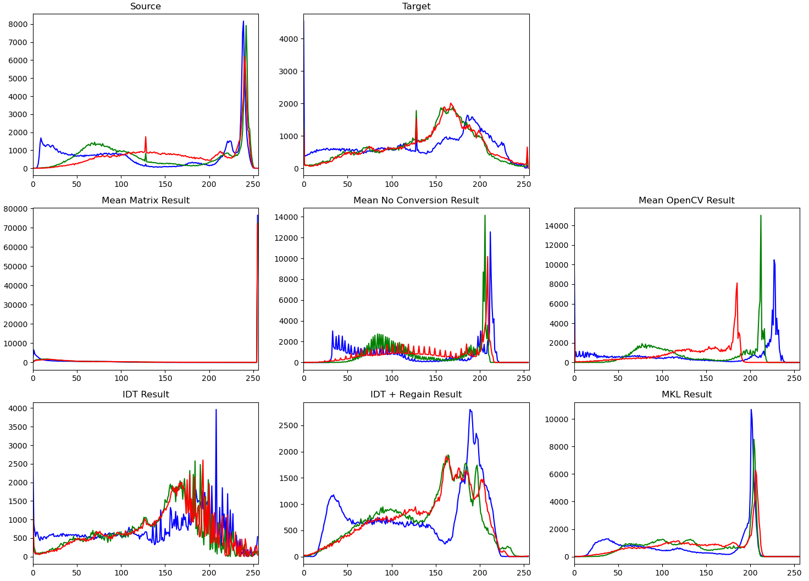
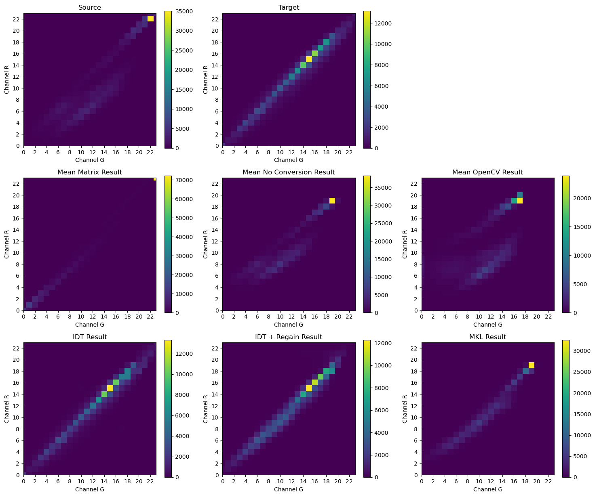
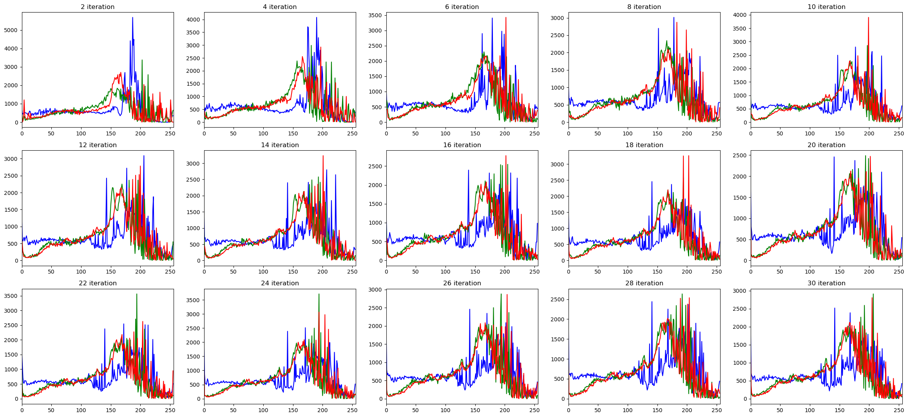

# Color Transfer between Images (PSCSE19-0033)
Color Transfer Between Images uses statistical analysis approach to colour correct the source image
by applying the applicable colour from target image to match the look and feel   


### Library Versions
- numpy >= 1.18.3
- scipy >= 1.4.1
- opencv-python >= 4.2.0.34
- matplotlib >= 3.2.1

### Example Usage
#### Available Models
```python

import cv2
from color_transfer.color_transfer import ColourXfer
from color_transfer.utils import cx_rgb2lab, cx_lab2rgb
from color_transfer.genr_result import genr_image_result, genr_1d_result, genr_2d_result, genr_idt_iter_result

# source and target must be in RGB on numpy array (height, width, channel)
source_bgr = cv2.imread("images/source.png", cv2.IMREAD_COLOR)
source_rgb = cv2.cvtColor(source_bgr, cv2.COLOR_RGB2BGR)
target_bgr = cv2.imread("images/target.png", cv2.IMREAD_COLOR)
target_rgb = cv2.cvtColor(target_bgr, cv2.COLOR_RGB2BGR)

# colour space conversion from rgb to lab
source_lab =  cx_rgb2lab(source_rgb)
target_lab =  cx_lab2rgb(target_rgb)

# mean and variance transfer with different colour space conversion
mean_matrix_rgb = ColourXfer(source_rgb, target_rgb, model='mean', conversion='matrix')
mean_noconv_rgb = ColourXfer(source_rgb, target_rgb, model='mean', conversion='noconv')
mean_opencv_rgb = ColourXfer(source_rgb, target_rgb, model='mean', conversion='opencv')

# probability density function (pdf) or iterative distribution transfer (idt)
idt_rgb = ColourXfer(source_rgb, target_rgb, model='idt')

# regrain colour transfer
regrain_rgb = ColourXfer(source_rgb, target_rgb, model='regrain')

# monge-kantorovitch linear transfer (mkl)
mkl_rgb = ColourXfer(source_rgb, target_rgb, model='mkl')

# all transferred results will be in RGB on numpy array (height, width, channel)
mkl_bgr = cv2.cvtColor(mkl_rgb, cv2.COLOR_RGB2BGR)
cv2.imwrite("images/mkl.png", mkl_bgr)

# image must be in png format
source = "images/exp1_source.png"
target = "images/exp1_target.png"
# plot image results from the above four transfer models
genr_image_result(source, target)
# plot RGB histogram results from the above four transfer models
genr_1d_result(source, target)
# plot GR 2D histogram results from the above four transfer models
genr_2d_result(source, target)
# plot iteration results from IDT model
genr_idt_iter_result()

```

### Image results consist of the Mean with different colour space, IDT, Regrain and MKL models**


### RGB histogram results consist of the Mean with different colour space, IDT, Regrain and MKL models


### GR 2D histogram histogram results consist of the Mean with different colour space, IDT, Regrain and MKL models


### Image results of the IDT's iterations


### RGB histogram results of the IDT's iterations


### GR 2D histogram results of the IDT's iterations

### References
- [Reinhard et al. 2001 Color Transfer between Images paper](http://erikreinhard.com/papers/colourtransfer.pdf)
- [Pitié et al. 2005 N-Dimensional Probability Density Function Transfer and its Application to Colour Transfer paper](https://github.com/frcs/colour-transfer/blob/master/publications/pitie05iccv.pdf)
- [Pitié et al. 2005 Towards Automated Colour Grading](https://github.com/frcs/colour-transfer/blob/master/publications/pitie05cvmp.pdf)
- [Pitié et al. 2007 Automated colour grading using colour distribution transfer](https://github.com/frcs/colour-transfer/blob/master/publications/pitie07cviu.pdf)
- [Pitie et al. 2007 The linear Monge-Kantorovitch linear colour mapping for example-based colour transfer](https://github.com/frcs/colour-transfer/blob/master/publications/pitie07cvmp.pdf)
